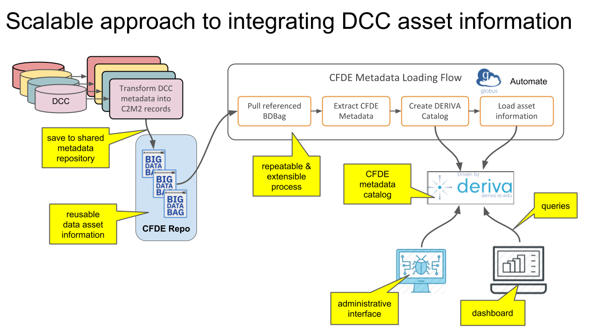
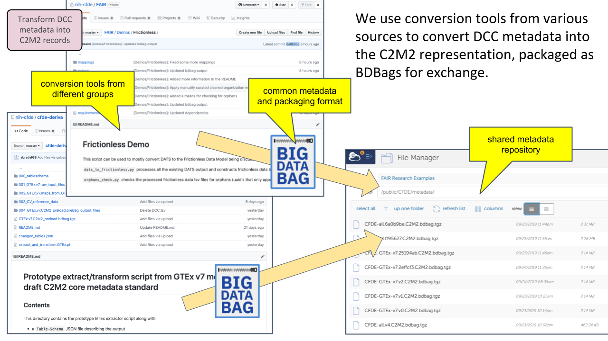

# Automated Generation of GTEx Metadata

_Goal_: Produce a GTEx data asset manifest in a reusable format.

*Method*: Develop scripts to convert the metadata released by GTEx into the [common CFDE format](cfde-metadata-format.html).

We have created a scalable process to transform DCC data asset metadata into the shared C2M2 model and store these manifests for use in the CFDE and by external entities. This the process on the left side of the following diagram.

To support per-DCC extensions and heterogeneity, separate scripts have been written to work on each DCC's metadata. These scripts create BDBags which are stored in a Globus endpoint for access by other CFDE team members and for input to create the cross-DCC metadata catalog.

[The GTEx conversion scripts](https://github.com/nih-cfde/cfde-deriva/tree/2019-09/extractors_and_metadata.GTEx) have been released as part of the CFDE GitHub organization.

[back](./)
