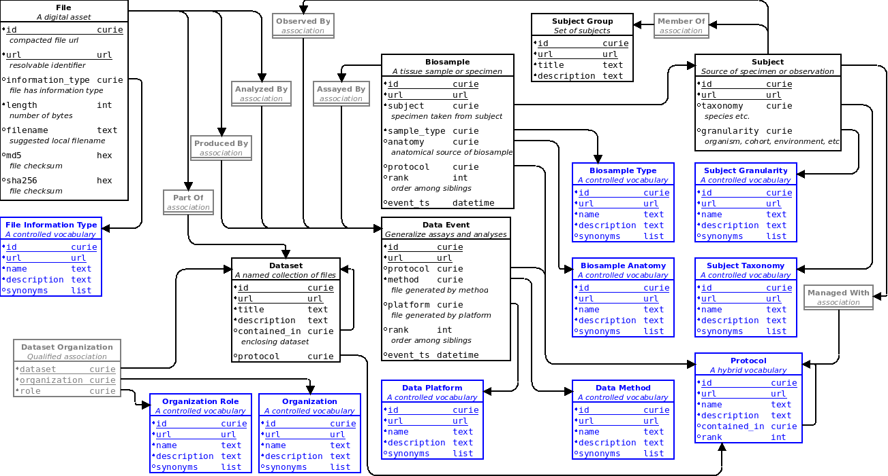

# Establishing CFDE Metadata Schemas and Serializations

_Goal_: Support description of hetergeneous DCC data assets

*Method*: Document the CFDE consensus regarding metadata models and representations for exchange

We produced a straw-man "core" metadata model to try to converge the discussions and near-term goals. This first model is focused on
tracking digital assets (files) grouped into datasets and contextualized by data-generating events (such as assays and analyses), biospecimens, subjects, and subject groups (cohorts).

To support per-DCC extensions and heterogeneity, we also identified the need for metadata exchange to include a model declaration for the
actual structure of the exchanged data. We chose to adopt [Frictionless Data Table Schema format](https://frictionlessdata.io/specs/table-schema/) as an extant, neutral format intended for this purpose. The proposed core model was both illustrated in the entity-relationship (ER) diagram above and [formalized using the Table Schema format](https://github.com/nih-cfde/cfde-deriva/blob/2019-08/table-schema/cfde-core-model.json).

[Simple scripts](https://github.com/nih-cfde/cfde-deriva/blob/2019-08/examples/tableschema_to_deriva.py) were also prototyped to convert the core model definedusing this Table Schema format and [deploy it in a Deriva test catalog](https://github.com/nih-cfde/cfde-deriva/blob/2019-08/examples/setup_c2m2_catalog.py). These scripts can produce an empty catalog suitable for development and testing of metadata ingest processes.

[back](./)
