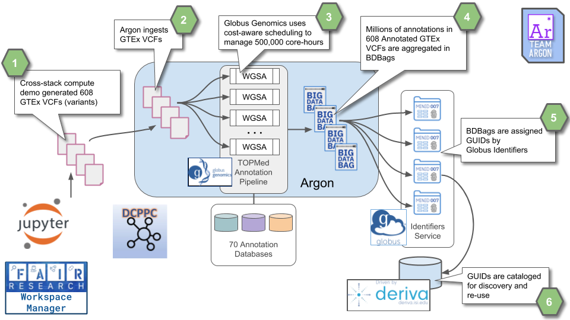

# Rapid Annotation of GTEx Genomic Variants with the TOPMed Annotation Pipeline

*Goal*: Rapidly and reliably aggregate variant annotations for large volumes
of whole genome sequence data, with results that are findable,
accessible, interoperable, and reusable: FAIR.

*Method:* Leverage cloud computing and [Commons](https://nihdatacommons.us) tools to run the [Whole Genome
Sequence Annotator](https://sites.google.com/site/jpopgen/wgsa) (WGSA) on many [GTEx](https://gtexportal.org/) genomes, with identifiers,
virtual cohorts, and reproducible pipelines used pervasively to ensure
FAIRness. 

## Scalable, Cost-Controlled Analysis for Data Enrichment

Large quantities of genome data are now available, but genome-wide
association studies that depend on rare variants lack statistical
power. Combining annotations from many sources provides a
comprehensive “genome map” boosting statistical power of association
studies. We demonstrate a high performance, parallel implementation of
[TOPMed](https://www.nhlbiwgs.org)’s annotation pipeline that uses 70 annotation databases to
annotate the SNPs and Indels from 608 GTEx variant (VCF) files to
create a data resource of millions of annotated variants that can then
be used in genome-wide association studies. Each annotation process
takes roughly 24 hours to complete on a 32-core node, for a total of
roughly 500,000 core-hours. The annotation pipeline uses cost-aware
provisioning to perform annotation on a compute cluster using spot
instances on the Amazon cloud.

## Re-Use of Data

This example highlights Re-Use and interoperability of data and
computational tools. The variant files come from the DCPPC Cross-Stack
Compute Demo while the annotation tool is from the TOPMed project. The
annotations are scaled across the input data using cost-aware cloud
provisioning to create a rapid yet inexpensive pipeline. The results
are packaged for sharing by using BDBags as a common data exchange
format and referenced by GUIDs with agreed upon metadata
conventions. Because the tools and services comprising this
architecture build on interoperable components (e.g., OAuth2/OIDC used
by Globus Auth) additional patterns emerge. This workflow can be
driven from by a [Jupyter](http://jupyter.org) notebook, beginning with calls to [DERIVA](http://docs.derivacloud.org) or
another portal for cohort creation, through the computation and its
requisite data handling, and back to DERIVA to associate the results
with the original cohort.

## The Data

The annotated VCFs are being aggregated into BDBags and assigned Minids (a type of KC2 GUID, [here's an example](https://identifiers.globus.org/ark:/57799/b95E1DXjoyity0)). We've made an [initial pull request](https://github.com/dcppc/full-stacks/pull/41) into the [DCPPC Full Stacks repository](https://github.com/dcppc/full-stacks/) to share these identifiers with the other teams. We'll update the new file created in that pull request (`gtex-wgs-annotated-vcf-wgsa.tsv`) as the annotation runs complete via additional pull requests. Also, the Minids will be ingested into our [DCPPC instance](https://nih-commons.derivacloud.org) of [DERIVA](http://docs.derivacloud.org) to tie these new files back to the original sequences.

## Slides

Check out [this presentation](6M.2.DEMOArgon.pdf) for more details about the science and components. 

[back](./)
